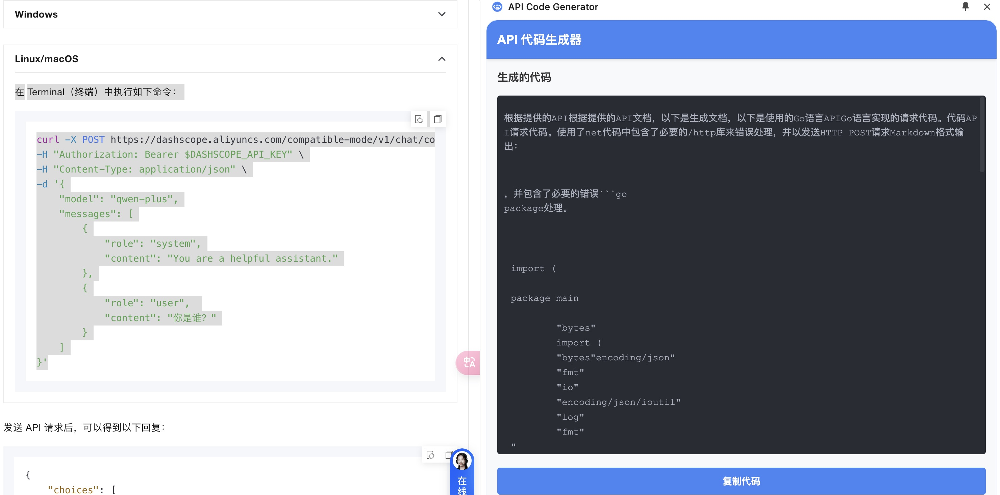

# API Code Generator

一个浏览器扩展，可以根据选中的 API 文档内容，自动生成对应的 API 调用代码。

## 功能展示

### 扩展介绍

### LLM 设置

### 代码生成

## 功能特点

- 支持通过右键菜单或工具栏按钮触发代码生成
- 支持选择多种编程语言生成对应的代码
- 实时生成代码，支持流式输出
- 支持自定义 API 端点和模型
- 内置代码高亮显示
- 一键复制生成的代码
- 支持侧边栏展示，不影响当前页面浏览

## 使用方法

1. 安装扩展后，需要先在扩展设置中配置 API Key
2. 在任意网页中选中 API 文档内容
3. 使用以下任一方式触发代码生成：
   - 右键选中内容，点击"生成 API 代码"
   - 点击浏览器工具栏的扩展图标（如果没有选中内容，将使用整个页面内容）
4. 在弹出的侧边栏中选择目标编程语言
5. 等待代码生成完成后，可以直接复制使用

## 配置选项

- API Key：用于访问 LLM 服务的密钥
- API 端点：可自定义 LLM 服务的接口地址
- 模型选择：支持选择不同的 LLM 模型
  - 默认使用 gpt-3.5-turbo
  - 支持配置自定义模型

## 注意事项

- 请确保 API Key 配置正确
- 生成的代码仅供参考，建议根据实际需求进行调整
- 如遇到请求频率限制，请稍后重试

## 技术栈

- Chrome Extension API
- JavaScript
- OpenAI API
- Markdown 解析
- 代码语法高亮

## 许可证

[MIT License](LICENSE)
